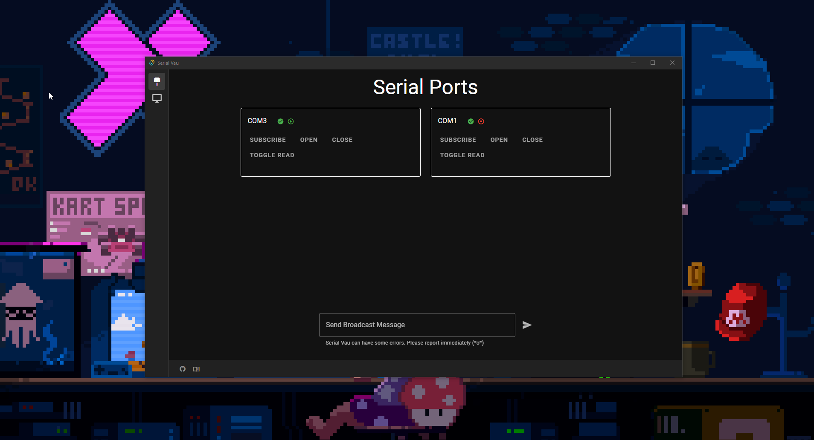

# Serial Vau

*Welcome to **Serial Vau*** A Monitoring Tool for sending and reaciving data.

## Setup

### Requirements

- Windows system
- Rust
- tauri-cli
- Node / npm

## 💿 Commands

| Package Manager                                               | Command            |
|---------------------------------------------------------------|--------------------|
| [ui & serial vau](https://tauri.app/)                         | `cargo tauri dev`  |
| [ui dev](https://docs.npmjs.com/cli/v7/commands/npm-install)  | `npm run dev`      |
| [serial vau](https://www.rust-lang.org/tools/install)         | `cargo run`        |

## ✨ Features

* 🛠️ **Subscription**: Activate Subscription to Subscribe to multiple devices.

* *More Features soon...*

#### Screenshots

## 💪 Support Serial Vau Development

* *Do you want to Contribut to Serial Vau?* **Just do it** ⚡

